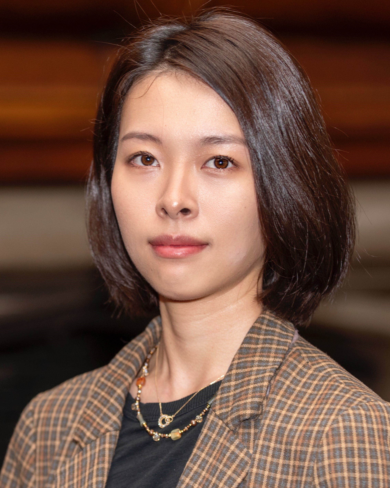

<!--  -->

I am Assistant Instructional Professor of GIScience at the [Center for Spatial Data Science](https://spatial.uchicago.edu/), [University of Chicago](https://www.uchicago.edu/). My research is situated at the intersection of **data**, **computation**, and **human values**, from which I aim to critically engage with geospatial computing both practically and theoretically. My research aims to answer the question: How can we develop computational methods, which are increasingly complex, to embody social responsibility, preserve privacy, and be used to understand and mitigate inequalities and injustices? My work has been focused on issues such as:

- **Fairness in spatial computing**: Integrating fairness, equitability, and other social justice principles into spatial optimization and machine learning to address the needs of individuals and communities with varying levels of vulnerability.
- **Digital privacy**: Developing methods to protect individual privacy while providing useful geospatial data.
- **Computing for social good**: Exploring how new geospatial computing methods can help understand and reduce inequalities and improve quality of life.

**Education**
- Ph.D. in Geography, The Ohio State University, 2023
- M.A. in Geography, The Ohio State University, 2022
- B.S. in Geographic Information Science, Wuhan University, 2019

If you'd like to get in touch, feel free to reach me by email at <liny2@uchicago.edu>. You can also follow me on [LinkedIn](https://www.linkedin.com/in/yue-lin-9536b019b/) and [ResearchGate](https://www.researchgate.net/profile/Yue-Lin-14).
